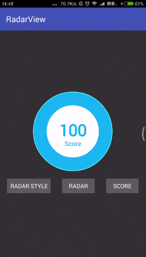

# RadarView
[](https://raw.githubusercontent.com/jenly1314/RadarView/master/app/app-release.apk)
[](https://jitpack.io/#jenly1314/RadarView)
[](https://android-arsenal.com/api?level=15)
[](https://opensource.org/licenses/mit-license.php)
[](http://blog.csdn.net/jenly121)
[](http://shang.qq.com/wpa/qunwpa?idkey=8fcc6a2f88552ea44b1411582c94fd124f7bb3ec227e2a400dbbfaad3dc2f5ad)

RadarView for Android 是一个雷达扫描动画后，然后展示得分效果的控件。

## Gif 展示


## 引入

### Maven：
```maven
<dependency>
  <groupId>com.king.view</groupId>
  <artifactId>radarview</artifactId>
  <version>1.0.2</version>
  <type>pom</type>
</dependency>
```
### Gradle:
```gradle
compile 'com.king.view:radarview:1.0.2'
```
### Lvy:
```lvy
<dependency org='com.king.view' name='radarview' rev='1.0.2'>
  <artifact name='$AID' ext='pom'></artifact>
</dependency>
```

###### 如果Gradle出现compile失败的情况，可以在Project的build.gradle里面添加如下：（也可以使用上面的GitPack来complie）
```gradle
allprojects {
    repositories {
        //...
        maven { url 'https://dl.bintray.com/jenly/maven' }
    }
}
```

## 示例

布局
```Xml
    <com.king.view.radarview.RadarView
        android:id="@+id/rv"
        android:layout_width="wrap_content"
        android:layout_height="wrap_content"
        android:text="100"
        app:labelText="Score" />
```

自定义属性
```Xml
    <declare-styleable name="RadarView">
        <attr name="android:textSize"/>
        <attr name="android:textColor"/>
        <attr name="android:text"/>
        <attr name="labelTextSize" format="dimension"/>
        <attr name="labelTextColor" format="color"/>
        <attr name="labelText" format="string"/>
        <attr name="format" format="string"/>
        <attr name="sideColor" format="color"/>
        <attr name="outsideBackgroundColor" format="color"/>
        <attr name="insideBackgroundColor" format="color"/>
        <attr name="duration" format="integer"/>
        <attr name="textOffsetY" format="dimension"/>
        <attr name="labelTextOffsetY" format="dimension"/>

        <attr name="circleColor" format="color"/>
        <attr name="lineColor" format="color"/>
        <attr name="showLine" format="boolean"/>
        <attr name="rotate" format="integer"/>
        <attr name="showLabel" format="boolean"/>
        <attr name="showText" format="boolean"/>
        <attr name="scanTime" format="integer"/>
        <attr name="insideStrokeWidth" format="dimension"/>
        <attr name="outsideStrokeWidth" format="dimension"/>
        <attr name="lineStrokeWidth" format="dimension"/>
    </declare-styleable>
```

代码示例（核心调用代码）
```Java
//开始雷达扫描
radarView.start();
//停止雷达扫描
radarView.stop();
//设置雷达扫描区域的颜色，传多个色值表示渐变
radarView.setScanColor(int... colors);
/**
 * 显示分数
 * @param from  初始值
 * @param to    目标值（最终分数）
 * @param duration  从初始值到目标值的动画持续时间
 * @param format
 * @param isShowAnim 是否显示动画
 */
radarView.showScore(float from, float to, int duration, final String format,boolean isShowAnim);

```

## 赞赏
如果您喜欢RadarView，或感觉RadarView帮助到了您，可以点右上角“Star”支持一下，您的支持就是我的动力，谢谢 :smiley:<p>
也可以扫描下面的二维码，请作者喝杯咖啡 :coffee:
    <div>
        
        
        
    </div>

## 关于我
   Name: <a title="关于作者" href="https://about.me/jenly1314" target="_blank">Jenly</a>

   Email: <a title="欢迎邮件与我交流" href="mailto:jenly1314@gmail.com" target="_blank">jenly1314#gmail.com</a> / <a title="给我发邮件" href="mailto:jenly1314@vip.qq.com" target="_blank">jenly1314#vip.qq.com</a>

   CSDN: <a title="CSDN博客" href="http://blog.csdn.net/jenly121" target="_blank">jenly121</a>

   Github: <a title="Github开源项目" href="https://github.com/jenly1314" target="_blank">jenly1314</a>

   加入QQ群: <a title="点击加入QQ群" href="http://shang.qq.com/wpa/qunwpa?idkey=8fcc6a2f88552ea44b1411582c94fd124f7bb3ec227e2a400dbbfaad3dc2f5ad" target="_blank">20867961</a>
   <div>
       
       
   </div>

   
   
   
